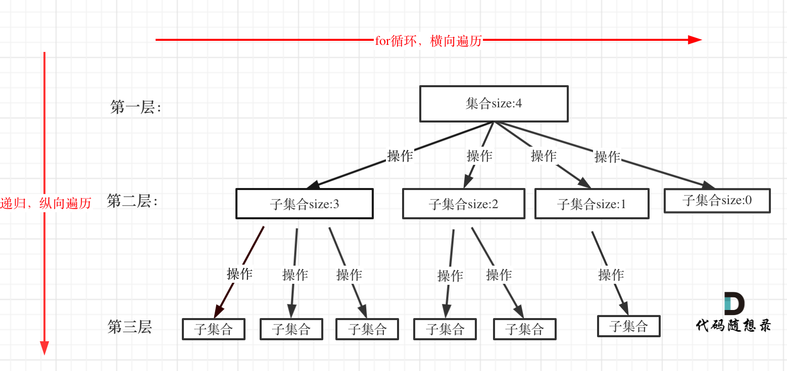
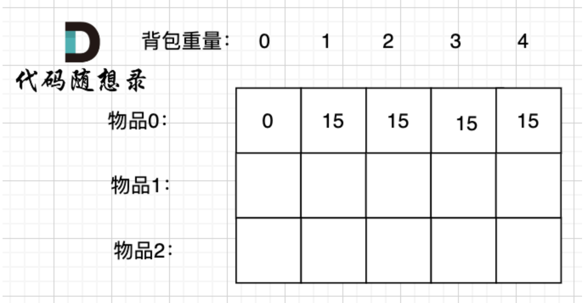

# 算法总结

## 链表总结

1. 利用 dummy节点统一删除头节点和中间节点的逻辑
2. 查找倒数第n个节点
   - 快慢指针法，快指针先走 n 步，慢指针再走，等快指针走到底时，慢指针即为删除的前置节点
   - 利用栈先进后出，先全部进栈，再依次弹出 n 个节点，栈顶即为删除的前置节点
3. 删除节点时需要考虑操作节点指针之间的顺序

## 哈希表

1. 数值比较小且连贯时，可以用数组下标来作为哈希表
2. 使用 set，map 来做哈希表每次 set 值的时候需要对 key 进行 hash 处理，此时对比数组直接用下标会有额外的性能开销

## 字符串

1. 大部分字符串都依靠双指针解决。
2. 少部分可以利用栈和队列的数据结构以及 KMP 算法来处理。

## 单调队列

### 底层存储

1. 单调队列也叫优先级队列，底层其实是一个堆，堆就是一棵完全二叉树，同时保证父子节点的顺序关系

### 单调队列应用场景

1. 滑动窗口极值问题​​：当需要在一个​​滑动窗口​​中快速获取最大值或最小值时，单调队列可以在 O(1) 时间返回极值。例如：
   - 窗口滑动时，移除窗口外的旧元素，保持队列头部始终是当前窗口的极值。
   - 每次新元素入队时，删除队列中比当前元素小（或大）的元素，保持单调性。
2. ​子数组问题优化​​：当问题涉及寻找满足特定条件的子数组（如最短长度、最长长度、区间和限制等），单调队列可以结合​​前缀和​​等技巧，快速判断子数组的合法性。
3. ​​动态规划优化​​：在动态规划问题中，如果状态转移方程需要从某个区间内获取极值，单调队列可以将时间复杂度从 O(n) 优化到 O(1)。

### 优先队列要点

1. 及时从队首弹出元素，保证队首为最值（最大或者最小）
2. 维护队列内部单调性
3. 队列存储下标更加通用

### LeetCode 中常见的单调队列题型​​

​1. ​滑动窗口极值​​  

- 239.滑动窗口最大值（模板题，必刷）
- 剑指 Offer 59 - II. 队列的最大值

​2. ​子数组和的最短/最长问题​​

- 862.和至少为 K 的最短子数组（结合前缀和 + 单调队列）
- 209.长度最小的子数组（暴力超时时可用单调队列优化）

​3. ​其他区间极值问题​​

- 1438.绝对差不超过限制的最长连续子数组（维护两个单调队列，分别存最大值和最小值）

### ​单调队列的实现要点​​

​1. ​队列中存储索引​​（而非直接存储数值），便于判断元素是否在窗口内。
​2. ​维护单调性​​：插入新元素前，从队列尾部删除破坏单调性的元素。
​3. ​删除过期元素​​：窗口滑动时，检查队首元素是否超出窗口范围，若超出则移除。

## 单调栈

单调栈是栈的变种，通过维护栈内元素的单调性（单调递增或单调递减），其依赖输入顺序，主要用来处理“邻近”关系。
其与优先队列的区别在于：单调栈解决​​顺序敏感​​的局部单调问题，优先队列解决​​动态全局优先级​​问题

### 单调栈应用场景

1. 邻近问题：下/上一个更大/小元素
2. 区间边界问题（在栈口形成凹形或者凸形结构）：接雨水、矩形面积

### 单调栈核心要点

1. 及时弹出无用元素
2. 维护栈内单调性
3. 栈内存储下标值更通用
4. 对于单调递增栈，经常会在左右两边预填充 0（[84] 柱状图中最大的矩形），防止边界问题

## 二叉树

### 种类

1. 满二叉树：如果一棵二叉树只有度为0的结点和度为2的结点，并且度为0的结点在同一层上。
2. 完全二叉树：除了最底层节点可能没填满外，其余每层节点数都达到最大值，同时最底层节点从左到右依次排列。
3. 二叉搜索树：二叉搜索树是一个有序树。
   - 若它的左子树不空，则左子树上所有结点的值均小于它的根结点的值；
   - 若它的右子树不空，则右子树上所有结点的值均大于它的根结点的值；
   - 它的左、右子树也分别为二叉排序树。
4. 平衡二叉搜索树：又被称为AVL（Adelson-Velsky and Landis）树，且具有以下性质：它是一棵空树或它的左右两个子树的高度差的绝对值不超过1，并且左右两个子树都是一棵平衡二叉树。
   - C++中map、set、multimap，multiset的底层实现都是平衡二叉搜索树，所以map、set的增删操作时间时间复杂度是logn；
   - unordered_map、unordered_set，unordered_map、unordered_set底层实现是哈希表。

### 存储方式

1. 链式存储：通过用链表指针的形式把分布在各个地址的节点串联一起。
2. 顺序存储：通过用数组的形式顺序存储，其元素在内存是连续分布的。父节点的数组下标是 i，那么它的左孩子就是 `i *2 + 1`，右孩子就是 `i* 2 + 2`

### 遍历方式

1. 深度优先搜索（前中后，其实指的就是中间节点的遍历顺序）
   - 前序遍历（递归法[底层是 函数调用栈]，迭代法[利用栈模拟递归]）
   - 中序遍历（递归法，迭代法）
   - 后序遍历（递归法，迭代法）
   - [DFS遍历方式](https://peigo.top/engineer-basic/structure-algorithm/%E4%BA%8C%E5%8F%89%E6%A0%91%E7%9A%84DFS.html#%E8%BF%AD%E4%BB%A3%E6%B3%95%E5%92%8C%E9%80%92%E5%BD%92%E6%B3%95%E5%AE%9E%E7%8E%B0%E4%BA%8C%E5%8F%89%E6%A0%91%E7%9A%84dfs)
2. 广度优先搜索
   - 层次遍历（迭代法[利用队列]）

## 递归三步曲

1. 确定递归终止条件
2. 确定递归的参数和返回值
3. 确定单层递归的逻辑

## 回溯算法

 回溯算法是一种暴力搜索的思想，通常回溯过程发生在递归函数的下一步。

### 回溯算法应用场景

1. 数组组合问题
2. 数组排列问题（排列强调顺序，组合不强调顺序）
3. 字符串切割问题
4. 数组求子集问题
   - 每个元素都可以 选｜不选，背包问题也是一种子集型回溯
5. 棋盘问题（N 皇后问题、解数独问题）

### 回溯算法模版

1. 回溯算法一般是在集合中递归搜索，并且解决的问题都可以抽象为一颗树形结构，其中集合的大小构成了树的宽度，递归的深度构成的树的深度。


```text
function backtracking(参数) {
    if (终止条件) {
        存放结果;
        return;
    }

    for (选择：本层集合中元素（树中节点孩子的数量就是集合的大小）) {
        处理节点;
        backtracking(路径，选择列表); // 递归
        回溯，撤销处理结果
    }
}
```

### 关于去重

1. 去重前需要判断是否应该对集合排序
2. 树层上在 for 循环前可以用 set 来去重，每次递归重新声明。
3. 树枝去重（排列问题）需要用 visited 数组传入递归函数中去重。

```text
function backtracking(参数) {
    if (终止条件) {
        存放结果;
        return;
    }

    // 声明 set 来做树层去重
    for (选择：本层集合中元素（树中节点孩子的数量就是集合的大小）) {
         if (set.has(选择)) {
               continue; // 树层去重
         }

         // 基于数组排序前提下，判断当前节点和上一个节点值相同
         if (当前节点和上一个节点值相同 && visited[上一节点] == false) {
               continue; // 树枝去重
         }

        处理节点;
        visited[选择] = true; // 处理节点
        backtracking(路径，visited, 选择列表); // 递归
        回溯，撤销处理结果
      visited[选择] = false; // 回溯
    }
}
```

## 贪心算法

1. 贪心算法是从局部最优解出发，推导出全局最优解的一种算法设计思想。
2. 在做贪心算法类题目时可以通过思考每个阶段的局部最优解是什么？局部最优能否推出全局最优。至于如何思考局部最优，更多是通过分析题目以及反证法的思路来进行推导。

### 难点题目

135.分发糖果
406.根据身高重建队列
763.划分字母区间
738.单调递增的数字
968.监控二叉树

## 动态规划

动态规划是一种将复杂问题分解为更简单的子问题的算法设计方法。它通过存储子问题的解来避免重复计算，从而提高效率。

### 动态规划的应用场景

1. 动规基础问题：斐波那契、爬楼梯
2. 背包问题
3. 打家劫舍问题
4. 股票买卖问题
5. 子序列问题：最长递增子序列、字符串编辑最小距离
6. 区间DP、概率 DP（难度过高不考虑）

### 动态规划思路拆解5步

1. DP 数组以及下标 的含义
2. 递推公式（状态转移方程）
3. DP 数组如何初始化以及边界条件
4. 遍历顺序（从小到大还是从大到小、背包问题先遍历背包还是先遍历物品）
5. 打印DP数组的变化过程（作为调试依据）

### 背包问题

#### 背包类型

1. 01 背包：n 种物品，每种物品只能选一次
2. 完全背包：n 种物品，每种物品可以选多次
3. 多重背包(不考虑)：n 种物品，每种物品个数各不相同

### 01 背包

有n件物品和一个最多能背重量为w 的背包。第i件物品的重量是weight[i]，得到的价值是value[i] 。每件物品只能用一次，求解将哪些物品装入背包里物品价值总和最大。

基本信息如下：


#### dp数组的含义

`dp[i][j]` : 下标 0-i 的物品任取放入容量为 j 的背包中，能获得的最大价值

### 递推公式

01 背包因为物品只能放入 1 次，所以可以先遍历每个物品，每个物品的状态为放入背包和不放入背包（也可以先遍历背包容量，从小到大依次递减，判断是否放入对应容量大小物品）。此时状态转移方程为：

```js
// 不放入物品 i，背包重量和价值不变: dp[i][j] = dp[i-1][j]
// 放入物品 i，背包重量减去物品 i 重量，价值增加物品 i 价值: dp[i][j] = dp[i-1][j-weight[i]] + value[i]
dp[i][j] = Math.max(dp[i-1][j], dp[i-1][j-weight[i]] + value[i])
```

### dp数组初始化和遍历顺序

由递推公式可知：`dp[i][j]` 的状态依赖于 `i-1` 和 `j-weight[i]`， 也就是依赖左边和上边，所以遍历顺序应该从左到右，从上到下。确保每个状态都能在使用前被计算出来。此时我们需要先初始化第一行状态:

1. `dp[0][j] = j >= weight[0] ? value[0] : 0` : 取决于背包容量 j 是否能放入物品 0（因为同个物品只能放入 1 次所以最大价值为物品 0 的价值），最大价值也为 0（不能放入）或者 value[0](能放入) 。
此时dp 数组初始化情况如下：


### 二维DP 数组模版

```js
// 1. 初始化二维数组为 0
// 2. 因为依赖上一行 i-1 的状态，所以需要初始化第一行。
// 遍历背包容量，从大于等于物品0 开始，背包价值为物品0 的价值
for (let j = weight[0]; j <= bagweight; j++) {
    dp[0][j] = value[0];
}
// weight数组的大小 就是物品个数
// 01 背包二维数组两个 for 循环先遍历物品和先遍历背包都是可以的。不影响状态转移
for(let i = 0; i < weight.length; i++) { // 遍历物品
   for(let j = 0; j <= bagweight; j++) { // 遍历背包容量
      if (j < weight[i]) {
         // 背包容量小于物品 i 的重量，不能放入物品 i
         // 此时最大价值和不放入物品 i 一样,不考虑放入物品 i ，避免数组下标 j - weight[i]为负数
         dp[i][j] = dp[i - 1][j]
      }else{
         dp[i][j] = Math.max(dp[i - 1][j], dp[i - 1][j - weight[i]] + value[i])
      };

   }
}
```

### dp数组降维

1. 由递推公式可知：不论是放入物品 i 还是不放入物品 i ，`dp[i][j]` 的状态都只依赖于 `dp[i-1]` 的状态，所以可以将 dp 数组由二维数组降维为一维数组。只维护 dp[i-1] 层的状态即可。
2. 此时 dp[j] 的含义即为：容量为 j 的背包能获得的最大价值。
3. 递推公式变为：`dp[j] = max(dp[j], dp[j-weight[i]] + value[i])`。 此时状态依赖 `dp[j-weight[i]]`，所以我们要考虑 dp[0] 的状态（这里 dp[0] 初始化状态表示背包容量 0，物品数量也为 0，也就是二维数组`dp[0][0]`的情况，并非是说考虑放入物品 0 第一行的最大价值，因为后续遍历时会不断更新dp[0]（j - weight[i]为 0） ，此时才是放入物品 0 时（对应二维第一行）的状态。）。
4. 一维数组模版

```js
// 1. 初始化一维数组为 0
let dp = new Array(bagweight + 1).fill(0);
// 2. 遍历背包容量，一维数组中我们只需要考虑 dp[0]的状态。非 0 下标由于 dp[j] = max(dp[j], dp[j - weight[i]] + value[i])且背包是倒序遍历的，不依赖 dp[i-1] 的状态，所以我们不需要像二维一样先初始化物品 0 的情况。
dp[0] = 0; // 当背包容量为 0 时，放满背包的最大价值为 0，所以这里也可以省略。但是算排列组合问题时这里需要初始化 dp[0] = 1;，表示背包容量为0的方法数为 1，即不放物品
// 3. 遍历物品，一维数组只能先遍历物品再遍历背包。否则背包的最大价值记录的都只会是某一个物品的最大价值了
for(let i = 0; i < weight.length; i++) { // 遍历物品
   // 4. 遍历背包容量，为了保证遍历背包容量时上一层的状态dp[j - weight[i]]不被覆盖，需要从大到小遍历背包容量。也可以理解倒序可以保证每个物品只被添加一次。
   for(let j = bagweight; j >= weight[i]; j--) { 
      dp[j] = Math.max(dp[j], dp[j - weight[i]] + value[i]);
   }
}
```

### 01背包解决排列组合

有n件物品和一个最多能背重量为w 的背包。每个物品可以放入 1 次，求放满背包的方法有几种。

#### 二维DP数组版本

1. 二维 DP 数组的含义：`dp[i][j]` 表示 0-i 个物品放入容量为 j 的背包的总方法。
2. 递推公式：`dp[i][j] = dp[i-1][j] + dp[i-1][j-weight[i]]`。即不放入物品 i 时放满背包容量 j 的方法数 + 放入物品 i时放满背包容量（此时背包容量为 j-weight[i] ）的方法数。
3. dp 数组初始化和遍历顺序：由递推公式可知，我们需要先初始化最上边行的状态（同 01 背包基础）。
   - 初始化第一行：`dp[0][i]`状态：当且仅当背包容量i等于物品 0 的重量时，放满背包的方法数为 1（即此时放入物品 0），否则为 0。
4. 二维 DP 数组模版

```js
// 1. 初始化二维数组为 0
let n = weight.length
let dp = new Array(n).fill(0).map(() => new Array(bagweight + 1).fill(0));
// 2. 初始化第一行和第一列
// 初始化第一行，
// 不放物品 0
dp[0][0] = 1;
// 放物品 0，防止数组下标溢出，加个判断
if (weight[0] <= bagweight) {
   // 只考虑物品 0 的情况下，当且仅当背包容量等于物品 0 的重量时，放满背包的方法数为 1，否则为 0
    dp[0][weight[0]] = 1;
}

// 3. 遍历物品和背包容量，二维数组先遍历物品还是背包都可以，背包遍历顺序正反也都可以
for (let i = 1; i < n; i++) { // 遍历物品
    for (let j = 1; j <= bagweight; j++) { // 遍历背包容量
        if (j < weight[i]) {
            dp[i][j] = dp[i - 1][j]; // 背包容量小于物品 i 的重量，不能放入物品 i
        } else {
            dp[i][j] = dp[i - 1][j] + dp[i - 1][j - weight[i]]; // 放入物品 i 和不放入物品 i 的方法数
        }
    }
}
```

#### 一维DP数组版本

1. 一维 DP 数组的含义：`dp[j]` 表示放入容量为 j 的背包的总方法数。
2. 递推公式：`dp[j] = dp[j] + dp[j-weight[i]]`。即不放入物品 i 时放满背包容量 j 的方法数 + 放入物品 i时放满背包容量（此时背包容量为 j-weight[i] ）的方法数。
3. dp 数组初始化和遍历顺序：由递推公式可知，我们需要先初始化dp[0]的状态（背包容量为 0，不放任何物品）
4. 一维数组递推公式也可以这样理解，dp[j] 的总方法拆解为：
   - 背包里面包含物品 0 的方法：dp[j - weight[0]](放入物品 0 时的方法数)
   - 背包里面包含物品 1 的方法：dp[j - weight[i]] (放入物品 1 时的方法数)
   - ...
   - 背包里面包含物品 n 的方法：dp[j - weight[n]] (放入物品 n 时的方法数)
   - 总的方法则是以上所有方法的和：dp[j] += dp[j - nums[i]];
5. 一维 DP 数组模版  

```js
// 1. 初始化一维数组为 0
let dp = new Array(bagweight + 1).fill(0);
// 2. 考虑背包容量为 0，物品 0 个的情况，即不放任何物品此时重量为 0，为 1 种方法（ 01 背包基础的差异点）
dp[0] = 1; 
// 3. 遍历物品和背包容量，一维数组先遍历物品再遍历背包
for (let i = 0; i < weight.length; i++) { // 遍历物品
   // 4. 遍历背包容量，为了保证遍历背包容量时上一层的状态dp[j - weight[i]]不被覆盖，需要从大到小遍历背包容量。也可以理解倒序可以保证每个物品只被添加一次。
   for (let j = bagweight; j >= weight[i]; j--) { 
      dp[j] += dp[j - weight[i]];
   }
}
```

### 完全背包

有N件物品和一个最多能背重量为W的背包。第i件物品的重量是weight[i]，得到的价值是value[i] 。每件物品都有无限个（也就是可以放入背包多次），求解将哪些物品装入背包里物品价值总和最大。

#### 完全背包模板（1 维数组）

```js
// 1. 初始化一维数组为 0
let dp = new Array(bagweight + 1).fill(0);
// 2. 考虑背包容量为 0，物品 0 个的情况
dp[0] = 0;
// 3. 遍历物品和背包容量，一维数组先遍历物品(完全背包问题也可以先遍历背包再遍历物品)
for (let i = 0; i < weight.length; i++) { 
   // 4. 遍历背包容量，完全背包物品可以被重复加入，所以要利用当前行的状态，也就是背包容量要正序遍历（与 01 背包的区别点）
   for (let j = weight[i]; j <= bagweight; j++) { 
      dp[j] = Math.max(dp[j], dp[j - weight[i]] + value[i]);
   }
}
```

#### 完全背包解决排列组合问题

有n件物品和一个最多能背重量为w 的背包。每个物品可以放入多次，求放满背包的方法有几种。

1. 这里一维递推公式和 01 一样，都是 `dp[j] += dp[j - weight[i]]`。
2. 初始化时: 需要考虑 dp[0] 状态（一般 dp[0] = 1）
3. 遍历顺序: 需要注意的是求方法数是排列还是组合：
   - 如果是组合问题（即物品放入顺序不同也属于同一种方法），则**需要先遍历物品再遍历背包容量**，此时才能保证 dp[j] 的状态是只会按照物品顺序依次更新的（遍历物品 0，更新 dp[j]，遍历物品 1 ,再更新 dp[j]，能保证物品 1 的状态是在物品 0 之后的，也就变相保证了物品顺序只会有物品 0、物品 1 的放入方法）。
   - 如果是排列问题（即物品放入顺序不同属于不同方法），则**需要先遍历背包容量再遍历物品**，根据背包容量 j 的逐渐增大，物品会频繁多次放入，第一次容量为 0 时循环物品 0 状态在物品 1 前更新，但是从容量 1 开始，物品 1 也会去更新物品 0 的状态。（也就会有先放物品 0 后放物品 1，和先放物品 1 再放物品 0 的两种放入方法）。
4. 完全背包排列组合问题一维 DP 数组模版：

```js
// 1. 初始化一维dp数组
let dp = new Array(bagweight + 1).fill(0);
// 2. 考虑背包容量为 0，物品 0 个的情况
dp[0] = 1; // 不放任何物品时，放满背包的方法数为 1
// 3. 组合问题先遍历物品后遍历背包容量
for (let i = 0; i < weight.length; i++) { // 依次遍历物品，所以这里只会有先物品 0、物品 1 的放入顺序。不会有先物品 1、物品 0 的情况
   // 4. 遍历背包容量。注意排列问题先遍历背包时，下标应该从 0 开始（此时 weight[i]也是未确定的）。
   for (let j = weight[i]; j <= bagweight; j++) { 
      dp[j] += dp[j - weight[i]];
   }
}
```

#### 爬楼梯思维解决完全背包排列问题

1. 思维转变：我们要爬背包重量层楼梯，每次能爬的步数在物品中选择，判断最后爬到楼顶用多少中方式（或者能否爬到楼顶）。
2. 爬楼梯到达楼顶总方式递推公式： 在爬到第 `j - climb[i]` 层楼梯的前提下，我们再爬 `climb[i]` 步即可到达楼顶。所以 `dp[j]` 的状态依赖于 `dp[j - climb[i]]` 的状态。我们需要考虑 `dp[0]` 的初始化，一般 `dp[0] = 1`，表示到达起始位置第 0 层的方式有 1 种，即不怕任何楼梯。此时递推公式为：`dp[j] += dp[j - climb[i]]`。
3. 爬楼梯能否到达楼顶递推公式：`dp[j] = dp[j - climb[i]]`。即在能爬到第 `j - climb[i]` 层楼梯的前提下，我们再爬 `weight[i]` 步即可到达楼顶。
4. 爬楼梯问题一维 DP 数组模版：

```js
// 1. 初始化一维dp数组，到达楼顶位置为 stairs +1，如果是能否抵达问题。则要初始化为 false
let dp = new Array(stairs + 1).fill(0);
// 2. 考虑在初始位置 0 层的情况 ，如果是能否抵达问题，则dp[0]初始化为 true
dp[0] = 1; // 不爬即可抵达为 1 种方法
// 3. 遍历楼梯
for (let j = 0; j <= stairs; j++) { // 遍历每个楼梯
   // 4. 遍历每次可以爬的步数 climb[i]
   for (let i = 0; i < climb.length; j++) { 
      let climb = climb[i]; // 当前爬的步数
      if (j <= climb) continue; // 如果当前楼梯层数小于爬的步数，则不能到达
      dp[j] += dp[j - climb[i]]; // 爬到第 j 层楼梯的方式等于爬到第 j - climb[i] 层楼梯的方式

      // 楼顶能否抵达问题：
      // if (!dp[j - climb[i]]) continue; // 如果前面楼梯没有到达方式，则不能到达当前层
      // dp[j] = dp[j - climb[i]]; // 如果前面楼梯有到达方式，则当前层楼梯的方式等于前面楼梯的方式
   }
}

return dp[stairs]; // 返回到达楼顶的方式 or 能否到达楼顶
```

### 打家劫舍问题

1. `dp[i]` 的含义: 表示**考虑**（注意：这里是考虑，并不是一定偷第 i 个）0-i 个房屋时，所能偷的最大金额。
2. 递推公式：第 i 个房屋有两种选择：偷或者不偷。
   - 如果偷第 i 个房屋，则不能偷第 i-1 个房屋，此时最大金额为 `dp[i-2] + nums[i]`（即前 i-2 个房屋的最大金额 + 第 i 个房屋的金额，这里 dp[i-2] 不一定代表 i-2 的房屋会偷，但是dp[i-2]时 i-1 的房屋一定不会偷，因为下标根本没有考虑到 i-1）。
   - 如果不偷第 i 个房屋，则最大金额为 `dp[i-1]`（同理，不偷 i，这里 dp[i-1]并不代表一定偷 i-1）。
   - 所以递推公式为：`dp[i] = max(dp[i-1], dp[i-2] + nums[i])`
3. 注意： 从上面的递推公式可以，i 的状态依赖于 i-1 和 i-2 的状态，在树形房屋时，想要获取 dp[i-2] 的状态并不方便(i-1 可以通过 node.left 和 node.right 获取)，所以此 dp[i] 的含义定义和公式并不通用。

#### 打家劫舍通用模板

1. 通用 dp[i] 的含义：表示考虑到第 0-i 个房屋时的**状态**，返回值为（偷 i 时最大金额，不偷 i 时最大金额）。如果求 i 所能偷的最大金额，则返回值为 `max(偷，不偷)`，这里不偷不一定小于偷，有可能不偷第 i 个，选择偷 i-1个。
2. 递推公式：第 i 个房屋时的状态：
   - 偷 i 最大金额: 不偷 i-1 + 第 i 个房屋金额，即 `dp[i][0] = dp[i-1][1] + nums[i]`
   - 不偷 i 最大金额为 : max(偷 i-1,不偷 i-1)，即 `dp[i][1] = max(dp[i-1][0], dp[i-1][1])`
   - 此时考虑 i 的最大金额为 `max(dp[i][0], dp[i][1])`
3. 通过将偷和不偷分别存储，可以将 i 的状态转为只依赖 i-1 的状态。所以在树形房屋的情况下，dp[node] 的转态可以表示为：
   - 偷 node: 偷 node + 不偷 node.left + 不偷 node.right，即 `dp[node][0] = node.val + dp[node.left][1] + dp[node.right][1]`
   - 不偷 node: node.left偷不偷取最大 (不一定偷 left，可能偷 left 的孩子) + node.right偷不偷取最大，即 `dp[node][1] = max(dp[node.left][0],dp[node.left][1]) + max(dp[node.right][0],dp[node.right][1])`
   - 此时考虑node 的最大金额为 `max(dp[node][0], dp[node][1])`

### 买卖股票问题

#### 买卖股票基础问题

1. dp 定义：
   - `dp[i][0]`：第 i 天持有股票的最高金额
   - `dp[i][1]`：第 i 天不持有股票的最高金额
2. 递归公式：
   - 从前面持有股票继承过来，或者第 i 天买入：
      `dp[i][0] = max(dp[i-1][0], dp[i-1][1]-prices[i]);`
   - 前面就已经卖出，或者第 i 天卖出(如果有手续费，则卖出时减去手续费 fee)：
      `dp[i][1] = max(dp[i-1][1], dp[i-1][0] + prices[i] - fee);`
   - 第 i 天最大利润：
      `profit = dp[i][1];`(不持有股票的现金一定比持有股票的现金多)
3. 初始化：
   - `dp[0][0] = -prices[0];`
   - `dp[0][1] = 0;`
4. 遍历顺序：
   - 从递归公式可知，`dp[i]` 的状态依赖 `dp[i-1]`，所以下标 1 开始从前往后遍历。

#### 买卖股票至多 k 次问题

1. k为 2 时 dp 定义：
   - `dp[i][0]`：第 i 天第一次持有股票的最高金额
   - `dp[i][1]`：第 i 天第二次持有股票的最高金额
   - `dp[i][2]`：第 i 天第一次不持有股票的最高金额
   - `dp[i][3]`：第 i 天第二次不持有股票的最高金额
2. 递归公式：
   - 第一次持有股票：`dp[i][0] = max(dp[i-1][0], -prices[i]);`
   - 第二次持有股票：`dp[i][1] = max(dp[i-1][1], dp[i-1][2] - prices[i]);`
   - 第一次不持有股票：`dp[i][2] = max(dp[i-1][2], dp[i-1][0] + prices[i]);`
   - 第二次不持有股票：`dp[i][3] = max(dp[i-1][3], dp[i-1][1] + prices[i]);`
3. 需要注意的时 dp 数组初始化：
   - `dp[0][0] = -prices[0];`
   - `dp[0][1] = -prices[0];` （这里可以理解为第一天买卖然后又买入，所以是 `-prices[0]` 而不是 0）
   - `dp[0][2] = 0;` (同理当天买卖所以金额为 0)
   - `dp[0][3] = 0;`
4. 遍历顺序：同买卖股票基础
5. 最终最大利润为 `max(dp[i][2], dp[i][3])`，因为第二次卖出一定包含第一次卖出了，所以也可以直接返回 `dp[i][3]`。
6. 第k次通用模版：

```rust
pub fn max_profit(k: i32, prices: Vec<i32>) -> i32 {
   if prices.len() == 1 {
      return 0;
   }

   // 1. 定义 DP 数组：dp[i][0..k]:第 1..k 次持有股票的金额，dp[i][k..2k]:第 1..k 次不持有股票的最高金额。
   let mut dp = vec![vec![0; 2 * k as usize]; prices.len()];
   // 2. 初始化第一天时持有状态的金额
   dp[0][0..k as usize].fill(-prices[0]);

   for i in 1..prices.len() {
      for j in 0..k as usize {
         // 第 i 天第 j 次持有: max(i-1 天持有, i-1 天第 j-1 次不持有 - prices[i])
         // 第 i 天第 j 次不持有：max(i-1天不持有, i-1 天第 j 次持有 + prices[i])
         let k = k as usize;
         // 第 j 次持有
         if j == 0 {
            dp[i][j] = dp[i - 1][j].max(-prices[i]);
         } else {
            dp[i][j] = dp[i - 1][j].max(dp[i - 1][j - 1 + k] - prices[i]);
         }
         // 第 j 次不持有
         dp[i][j + k] = dp[i - 1][j + k].max(dp[i - 1][j] + prices[i]);
      }
   }

   // 最后一次不持有
   return dp[prices.len() - 1][2 * k as usize - 1];
}
```

#### 买卖股票包含冷冻期

1. dp 定义：
   - `dp[i][0]`：第 i 天持有股票的最高金额
   - `dp[i][1]`：第 i 天不持有股票的最高金额
2. 递归公式：
   - 持有股票：
      1. 冷冻期为 k 天，则前 k 天只能买入一次：`dp[k][0] = max(dp[i-1][0], -prices[k])`
      2. 超过 k 天后, 继承前面持有或者第 i - 1 - k 天卖出时状态买入（k 为冷冻期）： `dp[i][0] = max(dp[i-1][0], dp[i-1-k][1] - prices[i]);`
   - 不持有股票：`dp[i][1] = max(dp[i-1][1], dp[i-1][0] + prices[i]);`
   - 第 i 天最大利润：`profit = dp[i][1];`
3. 初始化：
   - `dp[0][0] = -prices[0];`
   - `dp[0][1] = 0;`
4. 模版：

```rust
pub fn max_profit(prices: Vec<i32>) -> i32 {
   if prices.len() == 1 {
      return 0;
   }

   // 1. 定义DP
   let mut dp = vec![[0; 2]; prices.len()];

   // 2. 初始化 DP
   dp[0][0] = -prices[0];

   for i in 1..prices.len() {
      // 持有：分为两种情况
      // 前 k 天持有：前一天持有或者今天第一次买入
      // 超过 k 天后，继承前面持有或者第 i - 1 - k 天卖出时状态买入（k 为冷冻期）
      if i <= k {
         // 不能从前一天不持有状态流转，因为有冷冻期
         dp[i][0] = dp[i - 1][0].max(-prices[i]);
      } else {
         dp[i][0] = dp[i - 1][0].max(dp[i - 1 - k][1] - prices[i]);
      }
      // 不持有
      dp[i][1] = dp[i - 1][1].max(dp[i - 1][0] + prices[i]);
   }

   return dp[prices.len() - 1][1];
}
```

### 子序列问题

1. 需要注意 DP 数组的两种经典含义:
   - `dp[i][j]`含义 1 : 前 i 个元素 和前 j 个元素所形成的最优解。对于子序列相邻无关问题来说，含义 1用【选或不选】思考，例如 0-1 背包问题或者最长公共子序列 LCS；
   - `dp[i][j]`含义 2: 以下标i为结尾 和 以下标j为结尾所形成的最优解。对于子数组问题和子序列相邻相关来说，一般用含义2【枚举选哪个】思考，方便“拼接”，例如最大子数组和问题、最长递增子序列 LIS问题。
   - 为了方便处理 `dp[i][0]` 和`dp[0][j]` 状态时下标 i-1 越界，也可以将 DP 定义为前 i-1 个元素 、以下标 i-1 为结尾。
2. 递推公式：从含义 1 和含义 2 的角度出发，思考如何将当前状态转化为前一个状态。
   - 含义 1 的递推公式一般是通过选或不选当前元素来转化为前一个状态；
   - 含义 2 的递推公式一般是通过枚举当前元素和前一个元素的关系来转化为前一个状态。
   - 这两者含义区别在于：不选当前元素时，含义 1 不需要考虑前一个元素的状态，而含义 2 则需要考虑当前元素和前一个元素的状态转移
3. DP 数组初始化和遍历顺序
   - 如果没有定义为 i-1，那么遍历时单独处理 i 或 j 为 0 的情况，因为此时没有前一个状态可以继承。
4. 最优解：
   - 含义 1：因为是区间，所以 `dp[i][j]` 一定包含前面的最优解，直接返回最后一个状态即可
   - 含义 2：不是区间，最优解存在于过程任何一个状态中，所以用单独一个变量在生成状态过程中比较并修改最大值。

#### 编辑距离问题

给你两个单词 s1 和 s2， 请返回将 s1 转换成 s2 所使用的最少操作数。

1. DP 定义：本题是属于删与不删（选或不选）问题，因此 DP 定义为区间定义
   - `dp[i+1][j+1]`：表示 s1 前 i 个字符转为 s2 前 j 个字符的最小编辑距离。
2. 递推公式：
   - `s1[i] == s2[j]`: `dp[i+1][j+1] = dp[i][j]`
   - `s1[i] != s2[j]`: `dp[i+1][j+1] = min(dp[i+1][j],dp[i][j+1],dp[i][j]) + 1`
      1. s1插入字符：相当于删除一个 s2字符，`dp[i+1][j+1] = dp[i+1][j] + 1`
      2. s1删除字符：移除一个 s1 字符，`dp[i+1][j+1] = dp[i][j+1] + 1`
      3. 替换字符：相当于插入一个和 s2 相等的字符，接着同时删除该字符（一个步骤），此时状态为 `dp[i+1][j+1] = dp[i][j] + 1`
3. DP 数组初始化和遍历顺序：
   - 初始化：`dp[i][0] = i`， `dp[0][j]=j`，表示将 s1 前 i 个字符转为 s2 前 0 个字符需要 i 次删除，将 s1 前 0 个字符转为 s2 前 j 个字符需要 j 次插入。
4. 最优解：`dp[s1.length][s2.length]`，表示将 s1 转换为 s2 的最小编辑距离。
5. 模版：

```rust
pub fn min_distance(word1: String, word2: String) -> i32 {
   let word1: Vec<char> = word1.chars().collect();
   let word2: Vec<char> = word2.chars().collect();

   let mut dp = vec![vec![500; word2.len() + 1]; word1.len() + 1];
   // 初始化 DP[i][0] 和 DP[0][j]
   for i in 0..=word1.len() {
      dp[i][0] = i;
   }
   for j in 0..=word2.len() {
      dp[0][j] = j;
   }

   // 遍历 DP 数组
   for i in 0..word1.len() {
      for j in 0..word2.len() {
         dp[i + 1][j + 1] = if word1[i] == word2[j] {
            dp[i][j]
         } else {
            dp[i][j + 1].min(dp[i + 1][j]).min(dp[i][j]) + 1
         }
      }
   }

   return dp[word1.len()][word2.len()] as i32;
}
```

## 图论

### 图的基本概念

1. 种类：有向图、无向图、权值图
2. 度：连接节点的边的数量  
    1. 出度/入度：针对有向图而言，出度指从节点出去的边的数量，入度则相反
3. 连通性：表示节点的连通情况
    1. 连通图：针对无向图而言，任意两个节点都是可以到达的，则为连通图
    2. 强连通图：在有向图中，任意两个节点是可以相互到达的，则为强连通图
    3. 连通分量：无向图中的极大连通子图称之为该图的一个连通分量
    4. 强连通分量：在有向图中极大强连通子图称之为该图的强连通分量
4. 图的构造：邻接表、邻接矩阵 或者用对象直接表达
5. 图的遍历：BFS、DFS

### 图的遍历

1. DFS回溯模版：

   ```text
   function backtracking(参数) {
      if (终止条件) {
         存放结果;
         return;
      }

      for (选择：本节点所连接的其他节点) {
         处理节点;
         dfs(图，选择的节点); // 递归
         回溯，撤销处理结果
      }
   }
   ```

   leetcode:797.所有可能的路径

   ```rust
   pub fn all_paths_source_target(graph: Vec<Vec<i32>>) -> Vec<Vec<i32>> {
      fn backtrace(graph: &Vec<Vec<i32>>, n: i32, path: &mut Vec<i32>, res: &mut Vec<Vec<i32>>) {
         // 到达 n-1 节点，收集结果
         if n == (graph.len() - 1) as i32 {
               res.push(path.clone());
               return;
         }

         // 遍历 n 节点所有可达节点
         for i in graph[n as usize].iter() {
               path.push(*i);
               // DFS，n->i, 接着以 i 为起始节点继续往下深度搜
               backtrace(graph, *i, path, res);
               path.pop();
         }
      }

      let mut path = vec![];
      let mut res = vec![];

      path.push(0); // 起始节点 0
      backtrace(&graph, 0, &mut path, &mut res);

      return res;
   }
   ```

2. BFS 队列模版：

   ```rust
   // grid 是地图，也就是一个二维数组
   // visited 标记访问过的节点，避免重复访问，也可以直接修改 grid
   fn bfs(grid: &mut Vec<Vec<char>>) {
      // 上下左右四个方向
      let dir = [(0, 1), (0, -1), (-1, 0), (1, 0)];
      let row = grid.len();
      let col = grid[0].len();
      let mut queue = VecDeque::new();
      queue.push_back((0, 0)); //起始节点
      grid[0][0] = '1'; // 表示已访问

      while !queue.is_empty() {
         let (i, j) = queue.pop_front().unwrap();
         for (x, y) in directs {
            let x = i as i32 + x;
            let y = j as i32 + y;

            // bfs遍历节点周围，这里要避免 x,y 下标越界
            if (x >= 0 && x < row as i32)
               && (y >= 0 && y < col as i32)
               && grid[x as usize][y as usize] == '0'
            {
               // 处理节点
               grid[x as usize][y as usize] = '1';
               queue.push_back((x as usize, y as usize));
            }
         }
      }
   }
   ```
